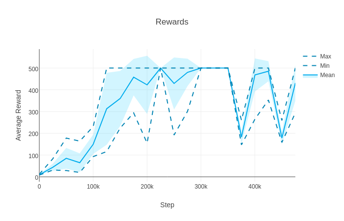
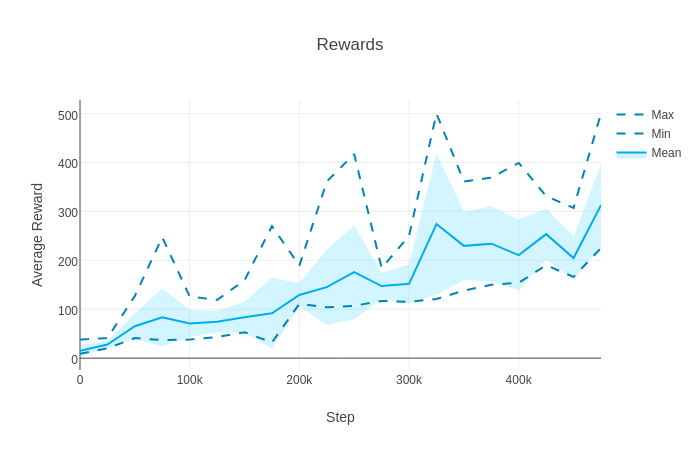

NoisyNet-A3C
============

NoisyNet [[1]](#references) (LSTM) asynchronous advantage actor-critic (A3C) [[2]](#references) on the CartPole-v1 environment. This repo has a minimalistic design and a classic control environment to enable quick investigation of different hyperparameters.

Run with `python main.py <options>`. Entropy regularisation can still be added by setting `--entropy-weight <value>`, but it is 0 by default. Run with `--no-noise` to run normal A3C (without noisy linear layers).

Requirements
------------

- [OpenAI Gym](https://gym.openai.com/)
- [Plotly](https://plot.ly/python/)
- [PyTorch](http://pytorch.org/)

To install all dependencies with Anaconda run `conda env create -f environment.yml` and use `source activate noisynet` to activate the environment.

Results
-------

### NoisyNet-A3C

On the whole, NoisyNet-A3C tends to be better than A3C (with or without entropy regularisation). There seems to be more variance, with both good and poor runs, probably due to "deep" exploration.

NoisyNet-A3C is perhaps even more prone to performance collapses than normal A3C. Many deep reinforcement learning algorithms are still prone to this.

### A3C (no entropy regularisation)

A3C without entropy regularisation usually performs poorly.

### A3C (entropy regularisation with β = 0.01)

A3C with entropy regularisation usually performs a bit better than A3C without entropy regularisation, and also poor runs of NoisyNet-A3C. The performance tends to be significantly worse than the best NoisyNet-A3C runs.

Note that due to the nondeterminism introduced by asynchronous agents, different runs on even the same seed can produce different results, and hence the results presented are only single samples of the performance of these algorithms. Interestingly, the general observations above seem to hold even when increasing the number of processes (experiments were repeated with 16 processes). These algorithms are still sensitive to the choice of hyperparameters, and will need to be tuned extensively to get good performance on other domains.

Acknowledgements
----------------

- [@ikostrikov](https://github.com/ikostrikov) for [pytorch-a3c](https://github.com/ikostrikov/pytorch-a3c)

References
----------

[1] [Noisy Networks for Exploration](https://arxiv.org/abs/1706.10295)  
[2] [Asynchronous Methods for Deep Reinforcement Learning](http://arxiv.org/abs/1602.01783)  
