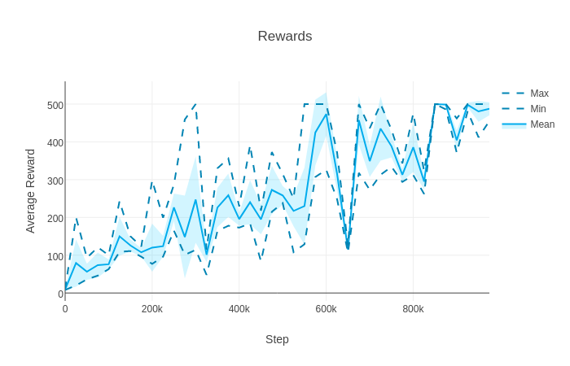

NoisyNet-A3C
============

NoisyNet [[1]](#references) (LSTM) asynchronous advantage actor-critic (A3C) [[2]](#references) with generalised advantage estimation (GAE) [[3]](#references). The agent also receives the previous action, reward and a step counter [[4]](#references). Run with `python main.py <options>`.

Run with `--no-noise` to run normal A3C (without noisy linear layers, but with entropy regularisation). NoisyNet-A3C disables entropy regularisation.

Requirements
------------

- [Python](https://www.python.org/)
- [PyTorch](http://pytorch.org/)
- [OpenAI Gym](https://gym.openai.com/)
- [Plotly](https://plot.ly/python/)

Results
-------

### NoisyNet-A3C

### A3C

Acknowledgements
----------------

- [@ikostrikov](https://github.com/ikostrikov) for [pytorch-a3c](https://github.com/ikostrikov/pytorch-a3c)

References
----------

[1] [Noisy Networks for Exploration](https://arxiv.org/abs/1706.10295)  
[2] [Asynchronous Methods for Deep Reinforcement Learning](http://arxiv.org/abs/1602.01783)  
[3] [High-Dimensional Continuous Control Using Generalized Advantage Estimation](https://arxiv.org/abs/1506.02438)  
[4] [Learning to Reinforcement Learn](https://arxiv.org/abs/1611.05763)  
